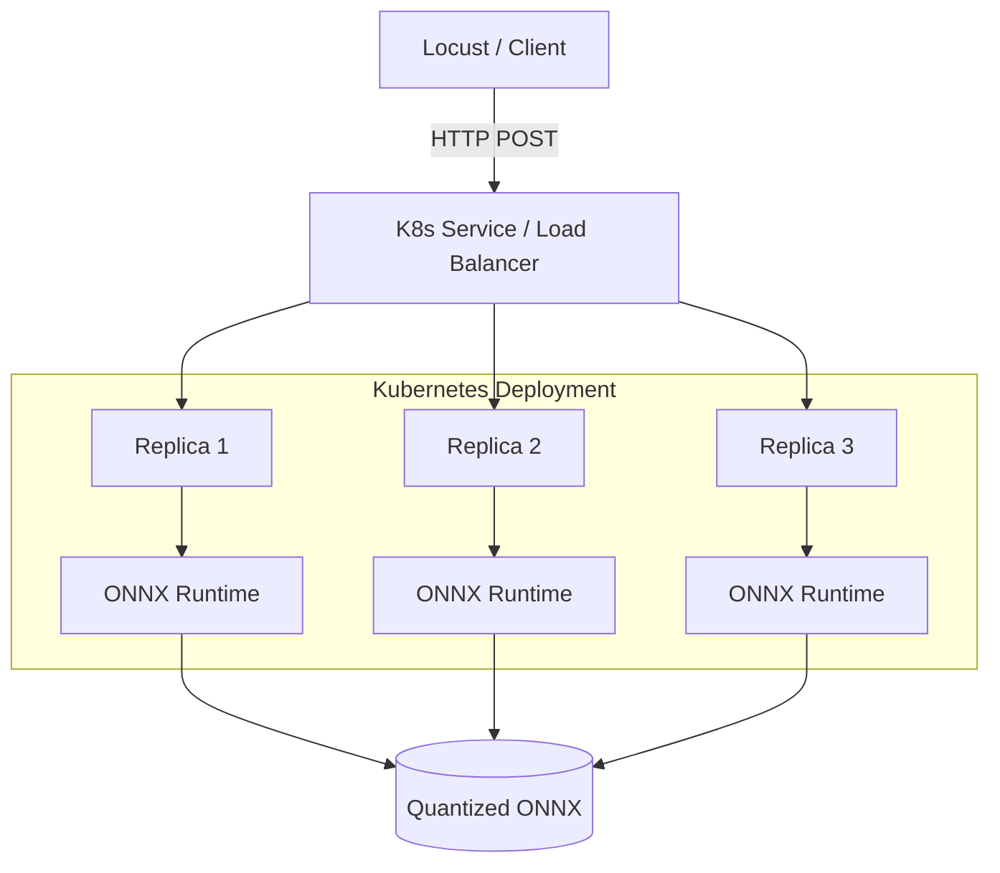

# Architecture & Optimization Flow

## Inference Optimization
ServeScale employs **ONNX Runtime (CPUExecutionProvider)** coupled with **Dynamic Quantization**.
Rather than serving dense 32-bit floating point models directly via PyTorch, the workflow:
1. Translates the model into `.onnx` representation.
2. Applies 8-bit dynamic integer quantization to weights (`QUInt8`), significantly reducing container memory footprint.
3. Serves the output without an active PyTorch overhead dependency.

## System Topology

> 📸 **Visual Diagram:** View the graphical version of this topology in our [v0.2.0 Run Report](../runs/v0.2.0_run.md#1-architecture-overview).

