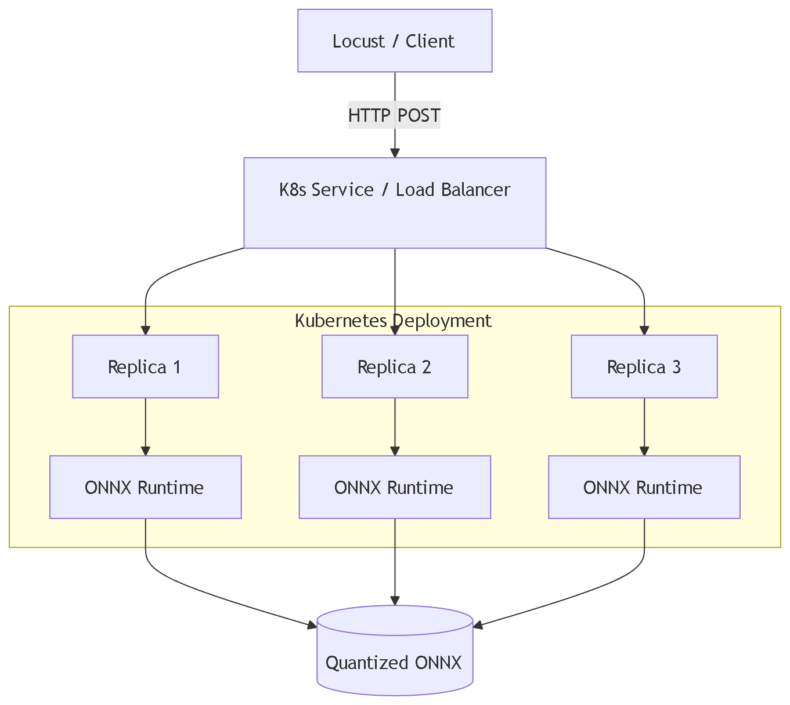
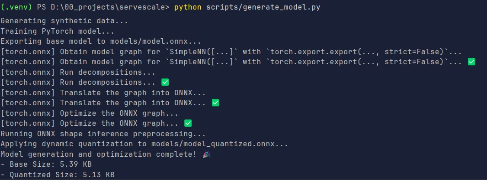
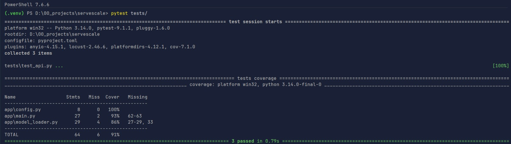
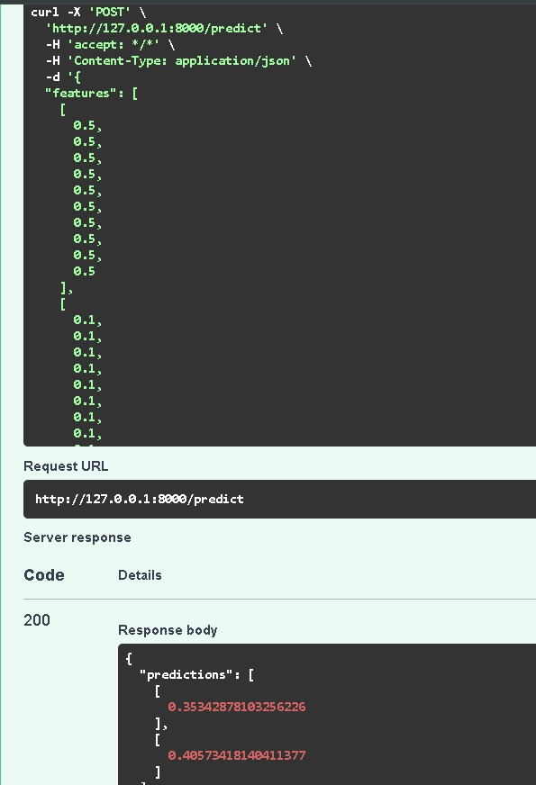
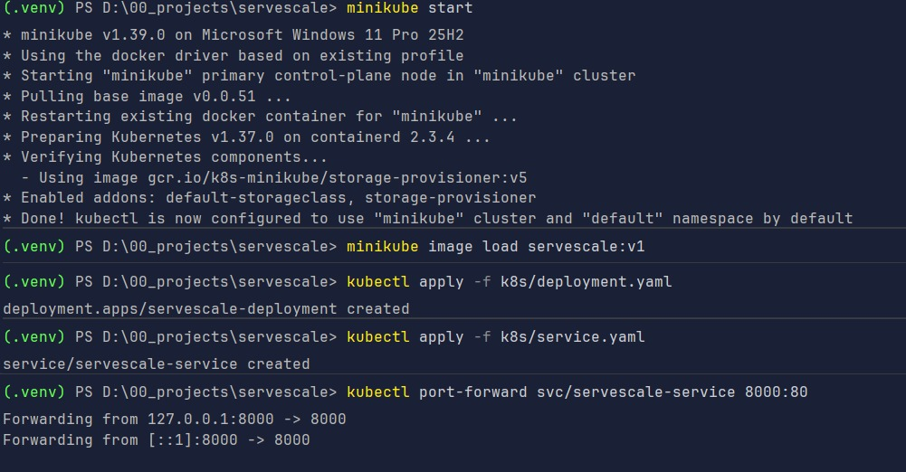
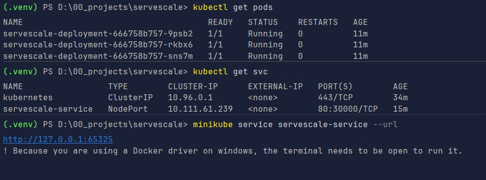
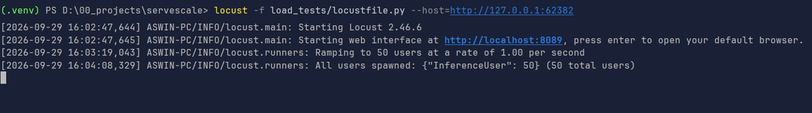
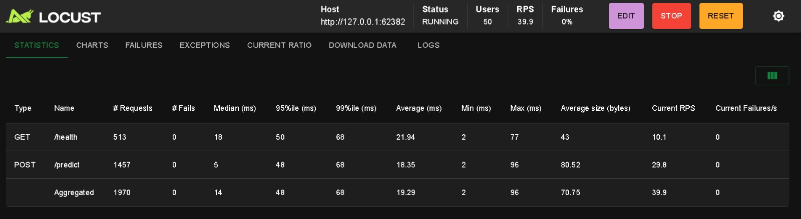
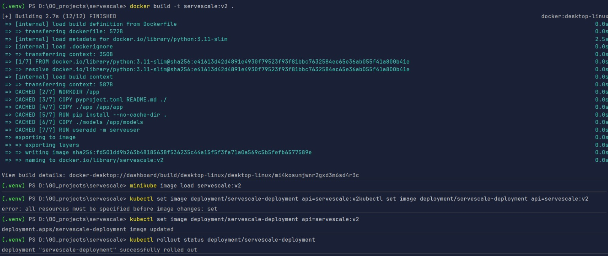
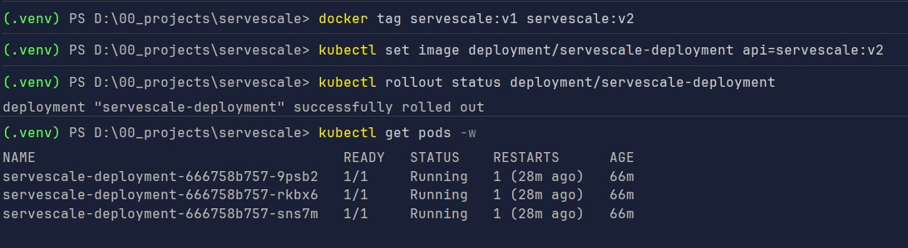

# Run Report: v0.2.0

This document contains visual verification and screenshots demonstrating the successful end-to-end local execution of
ServeScale (v0.2.0) using a Minikube Kubernetes cluster.

## 1. Architecture Overview

Visual representation of the K8s deployment topology and dynamic quantization flow.

## 2. Model Generation & Optimization

Generating the synthetic PyTorch model, exporting to ONNX, and applying dynamic quantization to minimize footprint.

## 3. Automated Testing

Execution of the Pytest suite ensuring endpoint stability and inference data validation.

## 4. API Verification

Testing the FastAPI endpoints via HTTP client/cURL to ensure successful prediction responses.

## 5. Kubernetes Setup & Deployment

Building the Docker container, loading it into Minikube, applying K8s manifests, and port-forwarding to local ports.

Retrieving the NodePort cluster URL and verifying service bindings.

## 6. Load Testing (Locust)

Starting the Locust master node to simulate concurrent user traffic and evaluate optimization performance.

Observing throughput (RPS), response times, and ensuring a baseline of 0 dropped requests prior to updates.

## 7. Zero-Downtime Rollout Execution

Triggering a Kubernetes Rolling Update while Locust is actively sending traffic. K8s gradually terminates old pods and
shifts traffic to new pods only after readiness probes pass.

Detailed terminal logs showing the image build, cluster load, and continuous transition with zero downtime.

